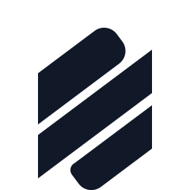
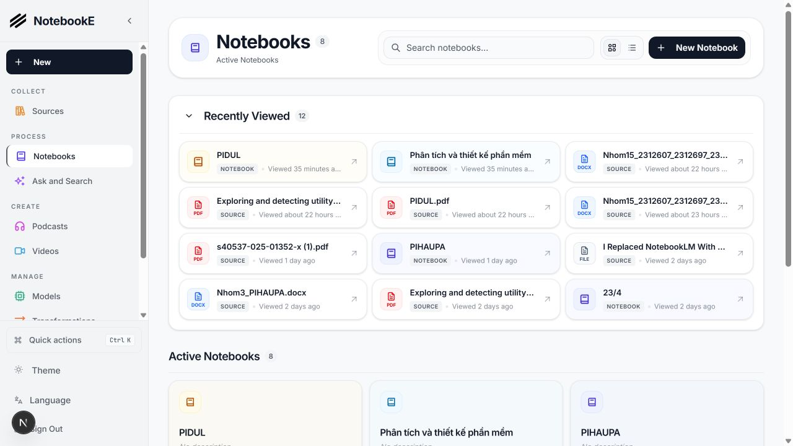
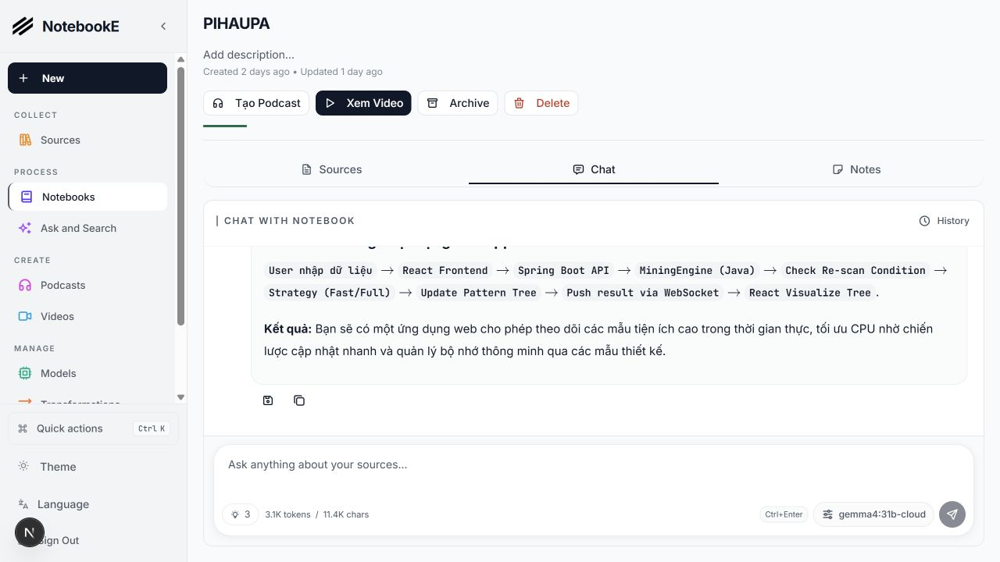
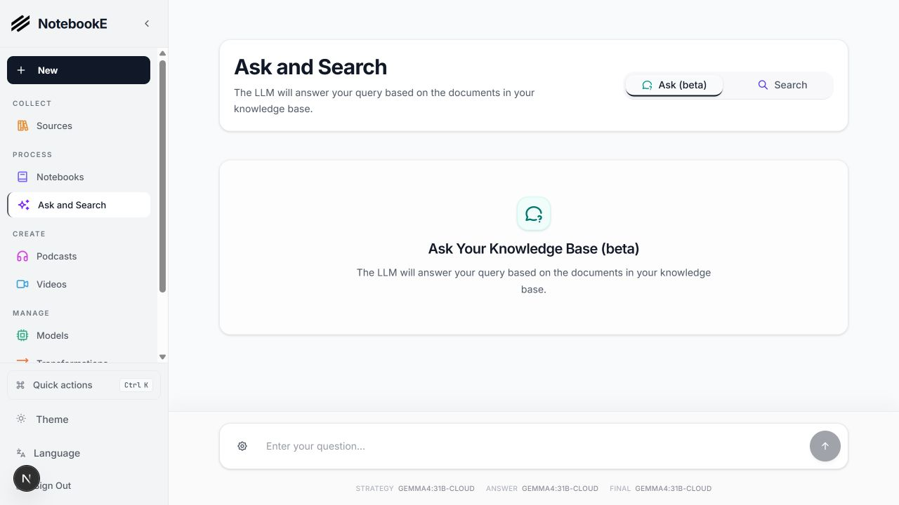
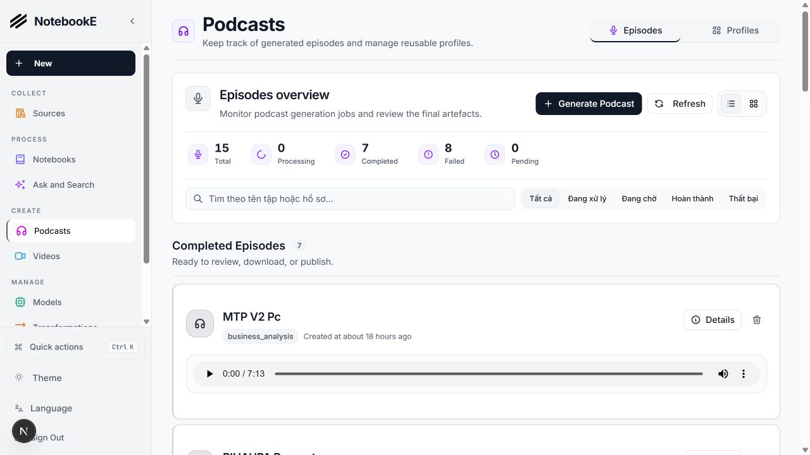
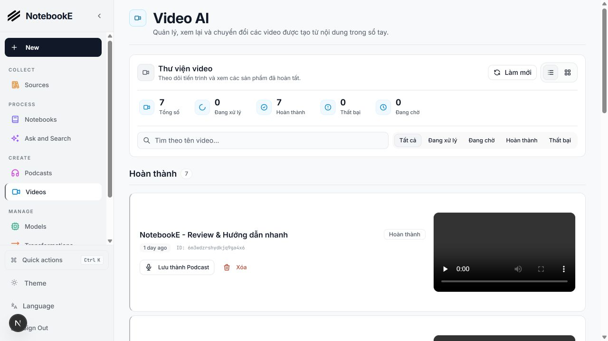

<a id="readme-top"></a>

<!-- [![Contributors][contributors-shield]][contributors-url] 
[![Forks][forks-shield]][forks-url]
[![Stargazers][stars-shield]][stars-url]
[![Issues][issues-shield]][issues-url]
[![MIT License][license-shield]][license-url]
[![LinkedIn][linkedin-shield]][linkedin-url] -->

<!-- PROJECT LOGO -->
<br />
<div align="center">
  <a href="https://github.com/Meranh05/NotebookE">
    
  </a>

  <h3 align="center">NotebookE</h3>

  <p align="center">
    <strong>Local AI that understands your documents and creates podcasts and videos directly on your PC.</strong>
    <br />
    A private, multi-model research workspace for turning source material into useful knowledge and media.
    <br />
    <br />
    <a href="docs/0-START-HERE/index.md">📚 Get Started</a>
    ·
    <a href="docs/3-USER-GUIDE/index.md">📖 User Guide</a>
    ·
    <a href="docs/2-CORE-CONCEPTS/index.md">✨ Features</a>
    ·
    <a href="docs/1-INSTALLATION/index.md">🚀 Deploy</a>
  </p>
</div>

<p align="center">
<a href="https://trendshift.io/repositories/14536" target="_blank"></a>
</p>

<div align="center">
  <!-- Keep these links. Translations will automatically update with the README. -->
  <a href="https://zdoc.app/de/lfnovo/notebooke">Deutsch</a> |
  <a href="https://zdoc.app/es/lfnovo/notebooke">Español</a> |
  <a href="https://zdoc.app/fr/lfnovo/notebooke">français</a> |
  <a href="https://zdoc.app/ja/lfnovo/notebooke">日本語</a> |
  <a href="https://zdoc.app/ko/lfnovo/notebooke">한국어</a> |
  <a href="https://zdoc.app/pt/lfnovo/notebooke">Português</a> |
  <a href="https://zdoc.app/ru/lfnovo/notebooke">Русский</a> |
  <a href="https://zdoc.app/ru/lfnovo/notebooke">Tiếng Việt</a> |
  <a href="https://zdoc.app/zh/lfnovo/notebooke">中文</a>
</div>

## A private AI research and media workspace that runs on your PC



NotebookE turns your documents, links, audio, and video into a searchable knowledge base. Ask questions with source context, organize research in notebooks, and create narrated podcasts or videos from the same material.

The system supports local AI through Ollama and OpenAI-compatible servers alongside cloud providers. Your frontend, API, database, background worker, Edge TTS narration, and video workflow can all run on your own computer.

**NotebookE empowers you to:**

- 🔒 **Control your data** - Keep your research private and secure
- 🤖 **Use local or cloud AI** - Connect Ollama, LM Studio, OpenAI-compatible endpoints, Google, OpenAI, Anthropic, and more
- 📚 **Organize multi-modal content** - PDFs, videos, audio, web pages, and more
- 🎙️ **Generate multi-speaker podcasts** - Reusable episode profiles, Eric and Luna presenters, live progress, outline tracking, and downloadable audio
- 🎬 **Create videos on your PC** - Build scripts, scenes, captions, visuals, narration, and final video from notebook content
- 🗣️ **Use Edge TTS narration** - Vietnamese voices with improved English technical pronunciation for podcasts and videos
- 🔍 **Search intelligently** - Full-text and vector search across all your content
- 💬 **Chat with context** - Stream answers from selected models, keep conversation history, and stop generation at any time
- ⚡ **See updates without refreshing** - Podcast and video jobs update in real time while background workers process them
- 🌐 **Use a multilingual UI** - Vietnamese, English, and other supported interface languages

### See NotebookE in action

| Notebook workspace | Ask and Search |
| --- | --- |
|  |  |

| Podcast production | Video production |
| --- | --- |
|  |  |

### How the system works

```text
Next.js web app :3000
        ↓
FastAPI service :5055
        ↓
SurrealDB :8000  +  background command worker
        ↓
Local/cloud LLMs  ·  Edge TTS  ·  Podcast pipeline  ·  Video pipeline
```

---

## 🆚 NotebookE vs Google Notebook LM

| Feature | NotebookE | Google Notebook LM | Advantage |
| --------- | --------------- | -------------------- | ----------- |
| **Privacy & Control** | Self-hosted, your data | Google cloud only | Complete data sovereignty |
| **AI Provider Choice** | Local and cloud models, including Ollama and OpenAI-compatible APIs | Google models only | Flexibility and local processing |
| **Podcast Speakers** | 1-4 speakers with custom profiles | 2 speakers only | Extreme flexibility |
| **Video Generation** | Script, scenes, visuals, captions, Edge TTS, and final rendering | Limited | A complete research-to-video workflow on your PC |
| **Content Transformations** | Custom and built-in | Limited options | Unlimited processing power |
| **API Access** | Full REST API | No API | Complete automation |
| **Deployment** | Docker, cloud, or local | Google hosted only | Deploy anywhere |
| **Citations** | Basic references (will improve) | Comprehensive with sources | Research integrity |
| **Customization** | Open source, fully customizable | Closed system | Unlimited extensibility |
| **Cost** | Pay only for AI usage | Free tier + Monthly subscription | Transparent and controllable |

**Why Choose NotebookE?**

- 🔒 **Privacy First**: Your sensitive research stays completely private
- 💰 **Cost Control**: Choose a cloud provider or run compatible models locally
- 🎙️ **Podcast and Video Creation**: Reuse your notebook context to produce scripts, speech, and rendered media
- 🔧 **Unlimited Customization**: Modify, extend, and integrate as needed
- 🌐 **No Vendor Lock-in**: Switch providers, deploy anywhere, own your data

### Built With

[![Python][Python]][Python-url] [![Next.js][Next.js]][Next-url] [![React][React]][React-url] [![SurrealDB][SurrealDB]][SurrealDB-url] [![LangChain][LangChain]][LangChain-url]

## 🚀 Quick Start

### Prerequisites

- Python 3.11+
- Node.js 20+
- Docker Desktop for SurrealDB
- FFmpeg for Podcast and Video rendering
- An AI provider, or a local model server such as Ollama or LM Studio

### Step 1: Clone and install

```bash
git clone https://github.com/Meranh05/NotebookE.git
cd NotebookE
uv sync
cd frontend && npm install && cd ..
```

### Step 2: Configure the environment

Copy `.env.example` to `.env`, set `OPEN_NOTEBOOK_ENCRYPTION_KEY`, and configure any provider credentials you need. Provider models can also be added later from **Models** in the web interface.

### Step 3: Start NotebookE

Start each service in dependency order:

```bash
make database
make api
make worker-start
make frontend
```

Or start the complete local stack:

```bash
make start-all
```

Open **<http://localhost:3000>**. The API runs at `http://localhost:5055` and SurrealDB at `http://localhost:8000`.

> The background worker is required for source processing, embeddings, Podcasts, and Videos. Jobs remain queued if the worker is not running.

### Docker deployment

For a container-based installation, download the project compose file:

```bash
curl -o docker-compose.yml https://raw.githubusercontent.com/Meranh05/NotebookE/main/docker-compose.yml
```

Set `OPEN_NOTEBOOK_ENCRYPTION_KEY` in `.env`, then start the containers:

```bash
docker compose up -d
```

Use `docker compose logs -f` to follow startup and migration progress. See the installation guide for local AI, storage, and production deployment options.

### Configure an AI provider

1. Go to **Models** and choose your provider (OpenAI, Anthropic, Google, etc.)
2. Click **+ Add Configuration**
3. Paste your API key and other info as needed and click **Add Configuration**
4. Click **Test** to test connection
5. Click **Sync Models** and check models to include
6. Assign the chat, transformation, embedding, and optional media models you want to use

Done! You're ready to create your first notebook.

> **Need an API key?** Get one from:
> [OpenAI](https://platform.openai.com/api-keys) · [Anthropic](https://console.anthropic.com/) · [Google](https://aistudio.google.com/) · [Groq](https://console.groq.com/) (free tier)

> **Want free local AI?** See [examples/docker-compose-ollama.yml](examples/) for Ollama setup

---

### 📚 More Installation Options

- **[With Ollama (Free Local AI)](examples/docker-compose-ollama.yml)** - Run models locally without API costs
- **[From Source (Developers)](docs/1-INSTALLATION/from-source.md)** - For development and contributions
- **[Complete Installation Guide](docs/1-INSTALLATION/index.md)** - All deployment scenarios

---

### 📖 Need Help?

- **🤖 AI Installation Assistant**: [CustomGPT to help you install](https://chatgpt.com/g/g-68776e2765b48191bd1bae3f30212631-notebooke-installation-assistant)
- **🆘 Troubleshooting**: [5-minute troubleshooting guide](docs/6-TROUBLESHOOTING/quick-fixes.md)
- **💬 Community Support**: [Discord Server](https://discord.gg/37XJPXfz2w)
- **🐛 Report Issues**: [GitHub Issues](https://github.com/Meranh05/NotebookE/issues)

---


## Provider Support Matrix

Thanks to the [Esperanto](https://github.com/lfnovo/esperanto) library, we support this providers out of the box!

| Provider     | LLM Support | Embedding Support | Speech-to-Text | Text-to-Speech |
|--------------|-------------|------------------|----------------|----------------|
| OpenAI       | ✅          | ✅               | ✅             | ✅             |
| Anthropic    | ✅          | ❌               | ❌             | ❌             |
| Groq         | ✅          | ❌               | ✅             | ❌             |
| Google (GenAI) | ✅          | ✅               | ✅             | ✅             |
| Vertex AI    | ✅          | ✅               | ❌             | ✅             |
| Ollama       | ✅          | ✅               | ❌             | ❌             |
| oMLX         | ✅          | ✅               | ❌             | ❌             |
| Perplexity   | ✅          | ❌               | ❌             | ❌             |
| ElevenLabs   | ❌          | ❌               | ✅             | ✅             |
| Deepgram     | ❌          | ❌               | ✅             | ✅             |
| Azure OpenAI | ✅          | ✅               | ✅             | ✅             |
| Mistral      | ✅          | ✅               | ✅             | ✅             |
| DeepSeek     | ✅          | ❌               | ❌             | ❌             |
| Cohere       | ✅          | ✅               | ❌             | ❌             |
| Voyage       | ❌          | ✅               | ❌             | ❌             |
| xAI          | ✅          | ❌               | ❌             | ✅             |
| OpenRouter   | ✅          | ✅               | ✅             | ✅             |
| DashScope (Qwen) | ✅          | ❌               | ❌             | ❌             |
| MiniMax      | ✅          | ❌               | ❌             | ❌             |
| Novita       | ✅          | ❌               | ❌             | ❌             |
| PayPerQ (PPQ) | ✅          | ✅               | ✅             | ✅             |
| OpenAI Compatible* | ✅          | ✅               | ✅             | ✅             |

*Supports LM Studio and any OpenAI-compatible endpoint. Prefer the native **oMLX** provider for [oMLX](https://omlx.ai/) (Apple Silicon); see [docs/5-CONFIGURATION/omlx.md](docs/5-CONFIGURATION/omlx.md).

## ✨ Key Features

### Core Capabilities

- **🔒 Privacy-First**: Your data stays under your control - no cloud dependencies
- **🎯 Multi-Notebook Organization**: Manage multiple research projects seamlessly
- **📚 Universal Content Support**: PDFs, videos, audio, web pages, Office docs, and more
- **🤖 Multi-Model AI Support**: 18+ providers including OpenAI, Anthropic, Ollama, Google, LM Studio, and more
- **🎙️ Professional Podcast Generation**: Advanced multi-speaker podcasts with Episode Profiles
- **🎬 Local Video Production**: Generate structured scenes, captions, visuals, Edge TTS narration, and rendered videos
- **🔍 Intelligent Search**: Full-text and vector search across all your content
- **💬 Context-Aware Chat**: AI conversations powered by your research materials
- **📝 AI-Assisted Notes**: Generate insights or write notes manually
- **⚡ Live Job Updates**: Follow Podcast and Video generation without reloading the page

### Advanced Features

- **⚡ Reasoning Model Support**: Full support for thinking models like DeepSeek-R1 and Qwen3
- **🔧 Content Transformations**: Powerful customizable actions to summarize and extract insights
- **🌐 Comprehensive REST API**: Full programmatic access for custom integrations [](http://localhost:5055/docs)
- **🔐 Optional Password Protection**: Secure public deployments with authentication
- **📊 Fine-Grained Context Control**: Choose exactly what to share with AI models
- **📎 Citations**: Get answers with proper source citations

## Podcast and Video Creation

NotebookE uses the same notebook context for both media workflows. Podcast generation supports reusable speaker and episode profiles, while Video generation turns research into planned scenes with synchronized narration and captions. Both workflows run as background jobs and update the interface as progress changes.


## 📚 Documentation

### Getting Started

- **[📖 Introduction](docs/0-START-HERE/index.md)** - Learn what NotebookE offers
- **[⚡ Quick Start with OpenAI](docs/0-START-HERE/quick-start-openai.md)** - Get up and running in 5 minutes
- **[🔧 Installation](docs/1-INSTALLATION/index.md)** - Comprehensive setup guide
- **[🎯 Run It Fully Local](docs/0-START-HERE/quick-start-local.md)** - Ollama/LM Studio, completely private

### User Guide

- **[📱 Interface Overview](docs/3-USER-GUIDE/interface-overview.md)** - Understanding the layout
- **[📚 Notebooks, Sources & Notes](docs/2-CORE-CONCEPTS/notebooks-sources-notes.md)** - Organizing your research
- **[📄 Adding Sources](docs/3-USER-GUIDE/adding-sources.md)** - Managing content types
- **[📝 Working with Notes](docs/3-USER-GUIDE/working-with-notes.md)** - Creating and managing notes
- **[💬 Chatting Effectively](docs/3-USER-GUIDE/chat-effectively.md)** - AI conversations
- **[🔍 Search](docs/3-USER-GUIDE/search.md)** - Finding information

### Advanced Topics

- **[🎙️ Podcast Generation](docs/2-CORE-CONCEPTS/podcasts-explained.md)** - Create professional podcasts
- **[🔧 Content Transformations](docs/3-USER-GUIDE/transformations.md)** - Customize content processing
- **[🤖 AI Models](docs/4-AI-PROVIDERS/index.md)** - AI model configuration
- **[🔌 MCP Integration](docs/5-CONFIGURATION/mcp-integration.md)** - Connect with Claude Desktop, VS Code and other MCP clients
- **[🔧 REST API Reference](docs/7-DEVELOPMENT/api-reference.md)** - Complete API documentation
- **[🔐 Security](docs/5-CONFIGURATION/security.md)** - Password protection and privacy
- **[🚀 Deployment](docs/1-INSTALLATION/index.md)** - Complete deployment guides for all scenarios
- **[🧭 Vision & Principles](VISION.md)** - What NotebookE is, and where it's going
- **[🛠️ Developer Docs](docs/7-DEVELOPMENT/index.md)** - Architecture, setup, contributing, decision records

<p align="right">(<a href="#readme-top">back to top</a>)</p>

## 🗺️ Roadmap

### Upcoming Features

- **Cross-Notebook Sources**: Reuse research materials across projects
- **Bookmark Integration**: Connect with your favorite bookmarking apps
- **More Video Templates**: Expand reusable landscape and vertical storytelling styles
- **Richer Citations**: Improve source-level evidence in chat, search, and generated media

### Recently Completed ✅

- **Next.js Frontend**: Modern React-based frontend with improved performance
- **Comprehensive REST API**: Full programmatic access to all functionality
- **Multi-Model Support**: 18+ AI providers including OpenAI, Anthropic, Ollama, LM Studio
- **Advanced Podcast Generator**: Professional multi-speaker podcasts with Episode Profiles
- **Local Video Workflow**: Script planning, visual generation, captions, Edge TTS, and rendering
- **Live Front-End Updates**: Podcast and Video progress refreshes without a full page reload
- **Async Processing**: Background workers keep long-running AI and media tasks responsive
- **Content Transformations**: Powerful customizable actions for content processing
- **Enhanced Citations**: Improved layout and finer control for source citations
- **Multiple Chat Sessions**: Manage different conversations within notebooks


<p align="right">(<a href="#readme-top">back to top</a>)</p>

## 📖 Need Help?

- **🤖 AI Installation Assistant**: We have a [CustomGPT built to help you install NotebookE](https://chatgpt.com/g/g-68776e2765b48191bd1bae3f30212631-notebooke-installation-assistant) - it will guide you through each step!
- **New to NotebookE?** Start with our [Getting Started Guide](docs/0-START-HERE/index.md)
- **Need installation help?** Check our [Installation Guide](docs/1-INSTALLATION/index.md)
- **Want to see it in action?** Try our [Quick Start Tutorial](docs/0-START-HERE/index.md)

## 🤝 Community & Contributing

### Join the Community

- 💬 **[Discord Server](https://discord.gg/37XJPXfz2w)** - Get help, share ideas, and connect with other users
- 𝕏 **[Follow @lfnovo on X](https://x.com/lfnovo)** - Project updates and news from the maintainer
- 💡 **[GitHub Discussions](https://github.com/Meranh05/NotebookE/discussions)** - Ask questions and shape features, product direction, design, and architecture
- 🐛 **[GitHub Issues](https://github.com/Meranh05/NotebookE/issues)** - Report reproducible bugs and find approved work
- ⭐ **Star this repo** - Show your support and help others discover NotebookE

### Contributing

We welcome contributions! We're especially looking for help with:

- **Frontend Development**: Help improve our modern Next.js/React UI
- **Testing & Bug Fixes**: Make NotebookE more robust
- **Feature Development**: Build the coolest research tool together
- **Documentation**: Improve guides and tutorials

**Current Tech Stack**: Python, FastAPI, Next.js, React, SurrealDB
**Future Roadmap**: Real-time updates, enhanced async processing

See our [Contributing Guide](CONTRIBUTING.md) for detailed information on how to get started, including our guidelines for [AI-assisted contributions](docs/7-DEVELOPMENT/contributing.md#ai-assisted-and-agent-generated-prs). To understand what we're building (and what we'll say no to), read [VISION.md](VISION.md).

<p align="right">(<a href="#readme-top">back to top</a>)</p>

## 📄 License

NotebookE is MIT licensed. See the [LICENSE](LICENSE) file for details.
<!--
**Community Support**:

- 💬 [Discord Server](https://discord.gg/37XJPXfz2w) - Get help, share ideas, and connect with users
- 𝕏 [Follow @lfnovo on X](https://x.com/lfnovo) - Project updates and news from the maintainer
- 💡 [GitHub Discussions](https://github.com/Meranh05/NotebookE/discussions) - Ask questions and shape ideas
- 🐛 [GitHub Issues](https://github.com/Meranh05/NotebookE/issues) - Report reproducible bugs and find approved work
- 🌐 [Website](https://www.notebooke.ai) - Learn more about the project

<p align="right">(<a href="#readme-top">back to top</a>)</p>

<!-- MARKDOWN LINKS & IMAGES -->
<!-- https://www.markdownguide.org/basic-syntax/#reference-style-links -->
[forks-shield]: https://img.shields.io/github/forks/Meranh05/NotebookE.svg?style=for-the-badge
[forks-url]: https://github.com/Meranh05/NotebookE/network/members
[stars-shield]: https://img.shields.io/github/stars/Meranh05/NotebookE.svg?style=for-the-badge
[stars-url]: https://github.com/Meranh05/NotebookE/stargazers
[issues-shield]: https://img.shields.io/github/issues/Meranh05/NotebookE.svg?style=for-the-badge
[issues-url]: https://github.com/Meranh05/NotebookE/issues
[license-shield]: https://img.shields.io/github/license/Meranh05/NotebookE.svg?style=for-the-badge
[license-url]: https://github.com/Meranh05/NotebookE/blob/main/LICENSE
[Next.js]: https://img.shields.io/badge/Next.js-000000?style=for-the-badge&logo=next.js&logoColor=white
[Next-url]: https://nextjs.org/
[React]: https://img.shields.io/badge/React-61DAFB?style=for-the-badge&logo=react&logoColor=black
[React-url]: https://reactjs.org/
[Python]: https://img.shields.io/badge/Python-3776AB?style=for-the-badge&logo=python&logoColor=white
[Python-url]: https://www.python.org/
[LangChain]: https://img.shields.io/badge/LangChain-3A3A3A?style=for-the-badge&logo=chainlink&logoColor=white
[LangChain-url]: https://www.langchain.com/
[SurrealDB]: https://img.shields.io/badge/SurrealDB-FF5E00?style=for-the-badge&logo=databricks&logoColor=white
[SurrealDB-url]: https://surrealdb.com/
